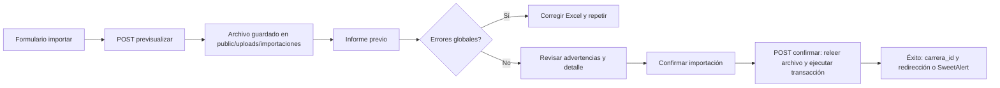

# Importación de carreras y mallas desde Excel

Este documento describe el **proceso funcional** y **técnico** de importar un plan de estudios desde un archivo Excel (formato tipo SIGEBI) hacia Biblioges.

## 1. Objetivo

Permitir cargar una malla curricular completa desde un `.xlsx` para:

- Crear una **carrera nueva** con su **plan nuevo** (registro en `carreras`, `carreras_espejos`, `asignaturas`, `asignaturas_departamentos`, `mallas`, y vínculos de formación cuando aplique).
- O bien crear un **espejo** de una carrera ya existente en otra sede/código de programa, reutilizando los `asignatura_id` de la malla de referencia y registrando los **códigos departamentales** propios de la sede.

La importación está pensada como un flujo de **dos pasos**: informe previo (validación) y **confirmación** explícita antes de escribir en base de datos.

## 2. Acceso en la aplicación

- Listado de carreras: botón **Importar Carrera** (o ruta equivalente según menú).
- **Rutas HTTP** (definidas antes de rutas genéricas `/{id}`):

| Método | Ruta | Descripción |
|--------|------|-------------|
| GET | `/carreras/importar` | Formulario: archivo, modo (nueva / espejo), carrera de referencia si es espejo. |
| POST | `/carreras/importar/previsualizar` | Sube el archivo, genera informe y guarda estado en sesión. |
| POST | `/carreras/importar/confirmar` | Ejecuta la transacción de importación (también vía AJAX con SweetAlert2). |
| POST | `/carreras/importar/cancelar` | Limpia el estado de importación en sesión. |

**Autenticación:** el usuario debe estar logueado; de lo contrario se redirige al login.

## 3. Almacenamiento del archivo subido

- Los archivos se guardan en:

  **`/var/www/html/biblioges/public/uploads/importaciones`**

- Implementación: clase `App\Services\CarreraExcelImportService`, método `guardarArchivoSubido()`.
- Nombre almacenado: base del nombre original + marca de tiempo (`Y-m-d_His`) + extensión `.xlsx`.
- El servidor web (por ejemplo `www-data`) debe poder **escribir** en esa carpeta (`propietario/grupo` o permisos de grupo).

En sesión (`carrera_importacion_pendiente`) se guarda, entre otros:

- `token`: antifalsificación CSRF para el paso de confirmación.
- `ruta_archivo`: ruta absoluta al `.xlsx` guardado.
- `modo_importacion`: `nueva` o `espejo`.
- `carrera_espejo_id`: id de `carreras` de referencia (solo modo espejo).

## 4. Formato del Excel

### 4.1 Hoja y cabeceras

- Se usa la **primera hoja** activa del libro.
- La fila 1 debe contener nombres de columnas. Se normalizan (mayúsculas, espacios a guiones bajos).

### 4.2 Columnas obligatorias

| Columna (Excel) | Uso |
|-----------------|-----|
| `CODIGO_PROGRAMA` | Código de programa / carrera espejo en el Excel. |
| `NOMBRE_PROGRAMA` | Nombre del programa. |
| `NIVEL` | Mapea `tipo_programa` de la carrera (`P`, `G`, etc.). |
| `INICIO_VIGENCIA` | Vigencia desde (6 dígitos `AAAAMM`). |
| `TERMINO_VIGENCIA` | Vigencia hasta (6 dígitos; `999999` = vigente). |
| `SEDE` | Nombre de sede (debe existir en tabla `sedes` o coincidir por búsqueda flexible). |
| `COD_UNIDAD_CARRERA`, `UNIDAD_CARRERA` | Unidad académica de la carrera en esa sede. |
| `SEMESTRE` | Ej. `S01` o `1` → semestre numérico. |
| `CODIGO_ASIGNATURA`, `NOMBRE_ASIGNATURA` | Asignatura en la fila. |
| `TIPO` | Tipo en lenguaje natural del Excel; se mapea a `ENUM` de `asignaturas.tipo`. |
| `COD_UNIDAD_ASIGNATURA`, `UNIDAD_ASIGNATURA` | Unidad departamental de la asignatura. |

### 4.3 Columnas opcionales (formación / electivas)

Si existen en el archivo:

- `CODIGO_ASIGNATURA_1`, `NOMBRE_ASIGNATURA_1`
- `COD_UNIDAD_FORMACION`, `UNIDAD_FORMACION`

Sirven para modelar **asignaturas hijas** de formación ligadas a un código padre.

### 4.4 Reglas de consistencia del archivo (errores globales)

En todas las filas con `CODIGO_PROGRAMA` no vacío debe cumplirse:

1. **Un solo código de programa** en todo el archivo (no se permite mezclar `8213` y `9213`, por ejemplo).
2. **Mismo** `INICIO_VIGENCIA` y `TERMINO_VIGENCIA` en todas las filas.
3. **Misma** `SEDE` en todas las filas.
4. Vigencias con formato **6 dígitos** numéricos.

Si falla alguna de estas reglas, aparecen **errores globales** y el botón de confirmar queda deshabilitado hasta corregir el Excel.

### 4.5 Errores por fila e importación parcial

- Problemas puntuales (por ejemplo semestre inválido, equivalencias en modo espejo sin match) se registran en **errores por fila**.
- Las filas **sin** esos conflictos pueden importarse igualmente (**importación parcial**): `puede_ejecutar` es verdadero si no hay errores globales y queda al menos una fila importable.

## 5. Modos de importación

### 5.1 Carrera con plan nuevo (`nueva`)

1. Inserta un nuevo registro en **`carreras`** (nombre normalizado, tipo según `NIVEL`, cantidad de semestres inferida del máximo en el Excel).
2. Inserta **`carreras_espejos`** para el código/sede/unidad de carrera del Excel y las vigencias del archivo.
3. Si ya existía un plan vigente con el **mismo** `codigo_carrera` y `sede_id` y `vigencia_hasta = 999999`, el proceso puede **cerrar** la vigencia anterior poniendo `vigencia_hasta = INICIO_VIGENCIA` del plan nuevo, abarcando todos los espejos relacionados del `carrera_id` detectado (ver servicio: `carreras_previas_relacionadas`).
4. Para cada código de asignatura necesario:
   - Si el código **no** existe en `asignaturas_departamentos`, crea **`asignaturas`** y **`asignaturas_departamentos`** (y unidad si falta).
   - Inserta **`mallas`** (`carrera_id`, `asignatura_id`, `semestre`).
5. **Formación:** inserta enlaces en `asignaturas_formacion` solo cuando cumplen reglas de tipos impuestas por la base (triggers); si no, se omiten sin abortar toda la importación.

### 5.2 Carrera espejo (`espejo`)

Requiere elegir una **carrera vigente de referencia** (`carrera_espejo_id`). El listado muestra: código - nombre - vigencia_desde - vigencia_hasta (espejos activos).

1. Inserta una nueva fila en **`carreras_espejos`** apuntando al **mismo** `carrera_id` de la referencia, con el código/sede/vigencias del Excel.
2. **Equivalencia de asignaturas:** no se usa el código del Excel para buscar en la referencia; se empareja por **nombre normalizado + semestre** (y tipo) contra la malla de la carrera de referencia cargada desde `mallas` + `asignaturas`.
3. **Código departamental:**
   - Si el `codigo_asignatura` **ya existe** en `asignaturas_departamentos` (único global en muchas instalaciones), **no** se duplica el registro: se reutiliza el `asignatura_id` vinculado y se agrega la fila a **`mallas`** con `INSERT IGNORE`.
   - Si el `asignatura_id` del código existente **no coincide** con el de la referencia por nombre, el informe previo muestra **recomendación de fusionar** asignaturas al editar la malla.
4. No se duplica la malla “conceptual”: si el `asignatura_id` ya estaba en `mallas` para esa carrera y semestre, el `INSERT IGNORE` no genera error.

Validación adicional: no puede existir ya un espejo con el mismo `carrera_id + codigo_carrera + sede_id` (restricción de negocio / índice).

## 6. Unidades y equivalencias

- Si una unidad de carrera o de asignatura no existe en la sede, el informe puede listarla en **unidades por crear**; al confirmar, opcionalmente se crean (confirmación vía interfaz cuando aplica).
- Archivo de configuración: **`src/config/unidades_equivalencias.php`**: traduce combinaciones código/nombre del Excel a los códigos/nombres usados en la tabla `unidades` (tipo unidad carrera / flujo equivalente en resolución).

## 7. Reglas especiales de negocio

1. **Electivas UN\***: asignaturas de formación cuyo código empieza por `UN` se tratan como marco de **formación electiva** padre; hijas en columnas `*_1` / formación.
2. **Sin unidad:** en ciertos casos de formación, la unidad departamental puede asociarse a la unidad especial “Sin unidad” según la lógica del servicio.
3. **Triggers de BD:** enlaces `asignaturas_formacion` que violen reglas del trigger se **omiten** en lugar de fallar toda la transacción.

## 8. Flujo resumido (usuario)

## 9. Componentes de código relevantes

| Pieza | Archivo |
|-------|---------|
| Servicio principal | `src/Services/CarreraExcelImportService.php` |
| Controlador HTTP | `src/Controllers/CarreraController.php` (`importarForm`, `importarPrevisualizar`, `importarConfirmar`, `importarCancelar`) |
| Rutas | `src/routes.php` |
| Vistas | `templates/carreras/importar.twig`, `templates/carreras/importar_previsualizar.twig` |
| Equivalencias de unidades | `src/config/unidades_equivalencias.php` |

## 10. Depuración y mensajes frecuentes

| Síntoma | Causa habitual |
|---------|----------------|
| No se pudo guardar el archivo | Permisos de escritura en `public/uploads/importaciones` para el usuario del servidor web. |
| Más de un código de programa | Filas con `CODIGO_PROGRAMA` distinto (typo en pocas filas). Unificar a un solo código en todo el libro. |
| Sede no encontrada | Texto en `SEDE` no coincide con `sedes.nombre` (revisar mayúsculas o crear/ajustar sede). |
| Duplicate entry en `codigo_asignatura` | Código ya existe globalmente; el modo espejo debe reutilizarlo (lógica actual del servicio). |
| Error trigger formación | Tipo padre/hijo no permitido; el enlace se omite. Revisar tipos en Excel o datos en BD. |
| Token inválido / sesión expirada | Volver a generar informe previo; el archivo debe seguir existiendo en disco. |

---

*Última actualización alineada con la ruta de carga `public/uploads/importaciones` y el comportamiento descrito en el código de `CarreraExcelImportService` y `CarreraController`.*
